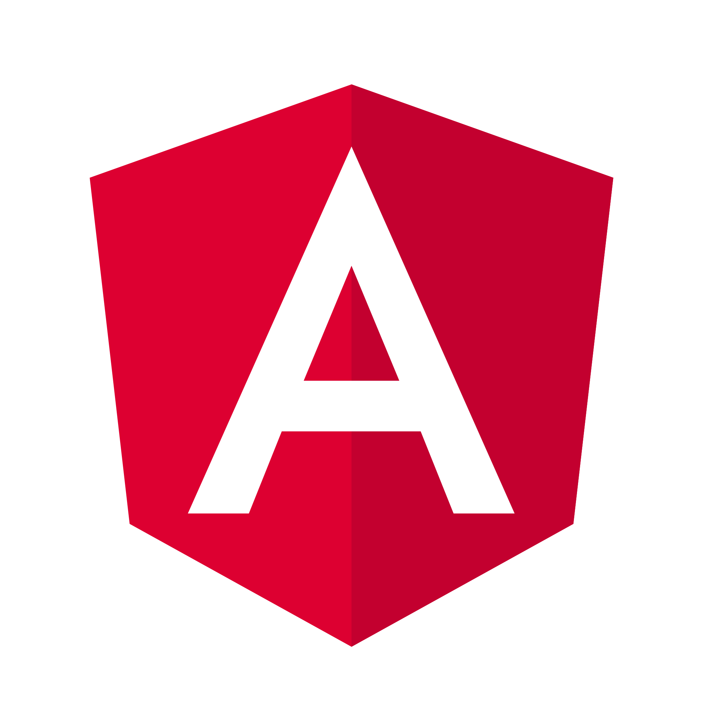

# Hola 👋,

Mi nombre es ***Sergio Garavito*** y esta es mi cuenta oficial, estaré actualizándola con nuevos proyectos como forma de entrenamiento para alcanzar mejorar mis habilidades actuales y adquirir nuevas destrezas en el proceso hacia mis metas propuestas.

Tengo interés en el desarrollo de sistemas empresariales que resuelvan los diferentes retos que deben afrontar las distintas áreas de una o varias organizaciones, manteniendo la integridad y buenas practicas en la implementación de soluciones.

Actualmente estoy adquiriendo y mejorando mis habilidades en Angular y Spring Boot.

Deseo revolucionar en el mundo de las soluciones empresariales.

## 💻 Nivel profesional:

🔰 **Junior**

## 🛠️ Tecnologías conocidas

* ***FrontEnd***

    
    
    
    
    

---

* ***Backend***

    
    
    
    

---

* ***Bases de datos***

    
    

---

* ***Sin enfoque aún***

    

---

## 👣 Otros repositorios:

1. **[Camper en Campuslands](https://github.com/CamperSergioGaravito)**
